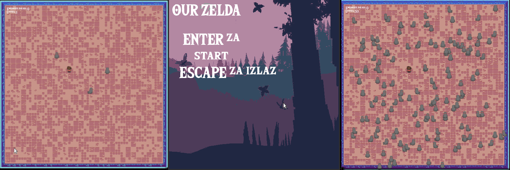

# Ime Teme

Our Zelda, igra rađena u Lua jeziku i framework-u love2d.

[gameplay video](https://streamable.com/k31zbl)

# Opis
Razvoj igre u framwork-u love2d od nule. Generisanje nivoa, programiranje igrača i neprijatelja.
Dodavanje grafike, zvukova i fontova.

# Planirani jezici i tehnologije

- Lua
- love2d
- GIMP za grafiku

# Pokretanje projekta

Preuzmite arhivu iz _releases_ otpakujte i pokrenite pokretanjem skripte `run.sh`.

# Uputstvo za igru

Igrač se pokreće na `strelice` udara na `space`.
Jedan udarac ubija neprijatelja i jedan udarac ubija igrača.
Kada ubijete sve neprijatelje prelazite na sledeći nivo.
Cilj je preživeti što duže.

# Prevođenje i pokretanje programa

Program pokrece `love2d` framework.  

# Za koji operativni sistem je napravljen izvršni fajl

Za `GNU/Linux` operativni sistem.

# Podaci o autorima i kontakt

- [Biljana Zečić](https://github.com/biljanazecic)
- [Stevan Nestorović](https://github.com/stevavoliajvar)
